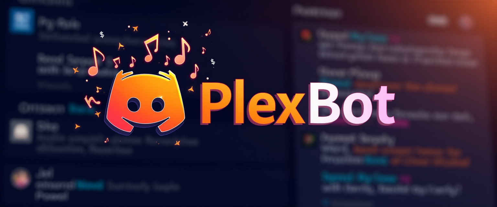
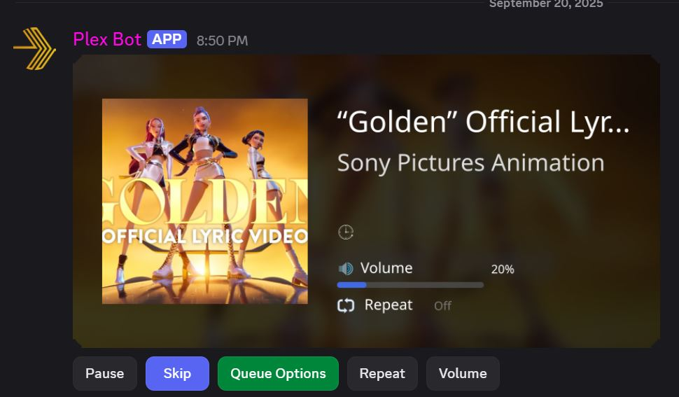
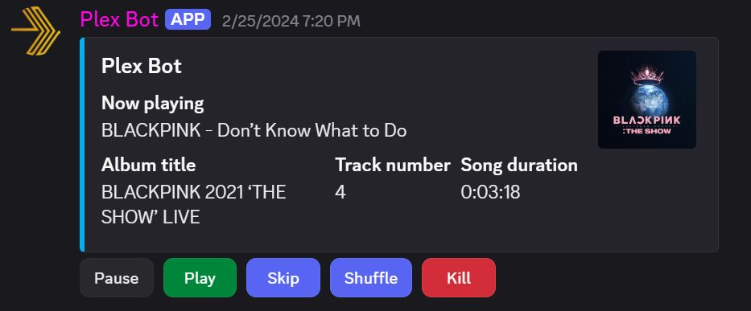

# 
> **Play your Plex music in Discord with style.** <sup><kbd>Alpha 0.5</kbd></sup>
---

<!-- PLACEHOLDER: Add screenshots of the Modern Visual Player and Classic Player Embed below -->

| Modern Visual Player | Classic Player Embed |
|:-------------------:|:-------------------:|
|  |  |

---

## What Does this bot do and why did I make it?

**PlexBot** is a next-generation Discord music bot designed for Plex users. Seamlessly stream your personal music library (and more!) into your server's voice channels, enjoy a beautiful visual player, and take advantage of a robust extension system for ultimate flexibility.

---

## Features

- **Stream from Plex**: Play tracks, albums, artists, and playlists directly from your Plex server.
- **Plex Sonic Features**: Mood & genre browsing via `/search`, plus Similar Tracks, Radio, and Sonic Adventure buttons on the player, all powered by Plex's neural audio analysis.
- **Radio**: Start a radio station from any track with one button press. Optionally enable infinite radio to auto-refill the queue.
- **YouTube Support**: Search and play music from YouTube via extension.
- **Interactive Player UI**: Choose between a modern image-based player or a classic Discord embed.
- **Static Player Channel**: Optionally dedicate a channel for the persistent player UI.
- **Rich Queue Management**: Add, remove, shuffle, and loop tracks with intuitive controls.
- **Slash Commands**: Clean, discoverable, and autocomplete-enabled.
- **Extensible**: Powerful [Extensions system](./Docs/Extensions/CreatingExtensions.md) for custom features.
- **Easy Setup**: [Guided installation](./Docs/Setup/Installation.md) and [Docker support](./Docs/Setup/Docker-Guide.md).
- **Troubleshooting & Guides**: [Player UI Guide](./Docs/Guides/Player-UI-Guide.md), [Troubleshooting](./Docs/Guides/Troubleshooting.md), and more.

---

## Planned & Upcoming Features

- **More Music Sources**: Spotify, SoundCloud, and additional streaming integrations.
- **User Custom Playlists**: Save, manage, and share your own playlists within Discord.
- **Expanded Command Set**: More slash commands for advanced control and new features.
- **Command Panel UI**: In static player channels, use an interactive command panel (embed with buttons) for a seamless experience (no slash commands needed).
- **Additional Visual Player Styles**: Choose from more themes and layouts for the player UI.
- **And much more...**

---

## Visual Player Styles

PlexBot offers two distinct player UIs:

### 1. Modern Visual Player
- **Sleek, image-based**: Uses album art as a background, overlaying track info and controls for a rich, modern look.
- **Best for dedicated channels**: Looks stunning as a persistent player in a static channel.

### 2. Classic Player Embed
- **Traditional Discord embed**: Familiar, compact, and works anywhere.
- **Great for multi-purpose channels**: Shows album art as a thumbnail.

All player settings are in `config.fds` (see [Configuration](#configuration) below).

For more, see the [Player UI Guide](./Docs/Guides/Player-UI-Guide.md).

---

## Slash Commands

<details>
<summary><b>/search [mode] [query]</b></summary>

Search across all sources with a unified mode selector. The mode dropdown includes built-in Plex features and any extension providers (YouTube, etc.). For Mood, Genre, and Radio modes the query autocomplete populates with real choices from your Plex library.

| Mode | Description | Query |
|------|-------------|-------|
| **Plex Library** | Search your Plex music library for artists, albums, and tracks | Free text |
| **Find by Mood** | Browse tracks by mood tags (e.g. "Happy", "Sad", "Energetic") | Autocomplete lists moods (randomized sample of 25) |
| **Find by Genre** | Browse tracks by genre (e.g. "Rock", "Jazz", "Electronic") | Autocomplete lists all genres |
| **Radio Station** | Pick a station or seed radio from a track | Autocomplete lists stations |
| *YouTube, etc.* | *Extension providers appear automatically when loaded* | Free text |

**Examples:**
- <code>/search mode:Plex Library query:"The Beatles"</code>
- <code>/search mode:Find by Mood query:Happy</code> pick a mood from the autocomplete dropdown
- <code>/search mode:Find by Genre query:Rock</code> pick a genre from the autocomplete dropdown
- <code>/search mode:Radio Station query:Library Radio</code> pick a station from autocomplete, or type a track name to seed radio
</details>

<details>
<summary><b>/playlist [playlist] [shuffle]</b></summary>
Play a full Plex playlist, optionally shuffled.
<br>Example: <code>/playlist playlist:"Summer Hits" shuffle:true</code>
</details>

<details>
<summary><b>/play [query]</b></summary>
Quickly play a track, album, or artist by search term.
<br>Example: <code>/play query:"Bohemian Rhapsody"</code>
</details>

<details>
<summary><b>/help</b></summary>
Show an interactive help menu with all commands and usage tips.
</details>

<details>
<summary><b>/ping</b></summary>
Test if the bot is responding to interactions.
</details>

### Sonic Player Buttons

The visual player's second row includes three Plex Sonic buttons that use neural audio analysis on the currently playing track:

| Button | Emoji | What it does |
|--------|-------|--------------|
| **Radio** | 📻 | Opens a panel with **Replace Queue** / **Add to Queue** / **Similar Tracks** options, seeded from the current track |
| **Similar** | 🔍 | Instantly shows 25 sonically similar tracks in a select menu |
| **Adventure** | 🧭 | Opens a popup where you type a destination track, then builds a sonic path from what's playing to the destination |

All three require a Plex track to be playing. When infinite radio is enabled in `config.fds`, the queue automatically refills when it runs low.

---

## Getting Started

See the [Installation Guide](./Docs/Setup/Installation.md) and [Configuration Guide](./Docs/Setup/Configuration.md) for full details.

### Prerequisites
- Docker & Docker Compose (Docker Desktop recommended)
- Discord bot token ([Developer Portal](https://discord.com/developers/applications))
- Plex server URL and token ([How to get a Plex token](https://support.plex.tv/articles/204059436-finding-an-authentication-token-x-plex-token/))

### Quick Install
```bash
git clone https://github.com/kalebbroo/PlexBot.git
cd PlexBot
```

1. **Secrets**: Copy `RenameMe.env.txt` to `.env` and fill in your credentials:
   ```env
   DISCORD_TOKEN=your-discord-bot-token
   PLEX_URL=http://your-plex-ip:32400
   PLEX_TOKEN=your-plex-token
   ```

2. **App settings** *(optional)*: `config.fds` is auto-created from the template with sensible defaults if it doesn't exist. To customize player style, logging, or behavior, copy `RenameMe.config.fds` to `config.fds` and edit it before starting (see [Configuration](#configuration) below).

3. **Run the install script**: `Install/win-install.bat` (Windows) or `Install/linux-install.sh` (Linux). This builds the Docker image, installs ffmpeg in the container, and starts the bot.

---

## Configuration

PlexBot uses **two config files**:

| File | Purpose | Template |
|------|---------|----------|
| `.env` | Secrets & infrastructure (tokens, URLs, passwords) | `RenameMe.env.txt` (manual copy required) |
| `config.fds` | Application settings (player UI, logging, behavior) | `RenameMe.config.fds` (auto-created if missing) |

### `.env` Secrets & Infrastructure

| Variable | Description | Required |
|----------|-------------|----------|
| `DISCORD_TOKEN` | Discord bot token | Yes |
| `PLEX_URL` | Plex server URL with port (e.g. `http://192.168.1.50:32400`) | Yes |
| `PLEX_TOKEN` | Plex authentication token | Yes |

### `config.fds` Application Settings

Uses [Frenetic Data Syntax](https://github.com/FreneticLLC/FreneticUtilities) (YAML-like format). All settings have sensible defaults and you only need to change what you want to customize.

#### Visual Player

| Key | Type | Default | Description |
|-----|------|---------|-------------|
| `visualPlayer.useModernPlayer` | bool | `true` | `true` = album art image player, `false` = classic Discord embed |
| `visualPlayer.inactivityTimeout` | float | `2.0` | Minutes of silence before the bot auto-disconnects from voice |
| `visualPlayer.staticChannel.enabled` | bool | `false` | Lock the player to one specific channel |
| `visualPlayer.staticChannel.channelId` | int | `0` | Discord channel ID (right-click channel > Copy Channel ID) |
| `visualPlayer.progressBar.enabled` | bool | `true` | Show a live-updating progress bar (updates every second). Disable to reduce Discord API calls |
| `visualPlayer.progressBar.size` | string | `medium` | Bar width: `small` (mobile-friendly, 10 segments), `medium` (default, 16 segments), `large` (wide displays, 22 segments) |
| `visualPlayer.progressBar.emoji.*` | int | _(empty)_ | Custom Discord emoji IDs for smooth-fill progress bar. Leave empty for unicode fallback (`▓░`) |

#### Plex

| Key | Type | Default | Description |
|-----|------|---------|-------------|
| `plex.maxConcurrentResolves` | int | `3` | Max parallel track resolves when loading playlists/albums from Plex. Lower if tracks fail to load; higher loads faster but may overwhelm Plex |
| `plex.maxConcurrentYouTubeResolves` | int | `5` | Max parallel track resolves when loading from YouTube. Separate limit allows higher concurrency for YouTube sources |
| `plex.radio.infinite` | bool | `false` | Enable infinite radio, which automatically refills the queue when it runs low |
| `plex.radio.refillThreshold` | int | `5` | Queue size threshold that triggers a refill when infinite radio is enabled |
| `plex.radio.batchSize` | int | `30` | Number of tracks to fetch per radio request (initial batch or refill) |

#### Logging

| Key | Type | Default | Description |
|-----|------|---------|-------------|
| `logging.level` | string | `INFO` | Console log level: `VERBOSE`, `DEBUG`, `INFO`, `WARN`, `ERROR`. Log files always save all levels |
| `logging.saveToFile` | bool | `true` | Save log files to disk |
| `logging.path` | string | `logs/plex-bot-[year]-[month]-[day].log` | Log file path (supports `[year]`, `[month]`, `[day]`, `[hour]`, `[minute]`, `[second]`, `[pid]`) |

#### Bot

| Key | Type | Default | Description |
|-----|------|---------|-------------|
| `bot.environment` | string | _(empty)_ | Set to `Development` for guild-scoped slash commands (faster updates during dev) |

### Custom Progress Bar Emoji

PlexBot includes 30 custom emoji for a smooth-fill progress bar. Without them, the bar uses unicode block characters (`▓░`) which work everywhere but look less polished.

<details>
<summary><b>Setup instructions</b></summary>

1. Go to the [Discord Developer Portal](https://discord.com/developers/applications) and select your bot application
2. Click **Emojis** in the left sidebar
3. Upload all 30 `.png` files from `Images/Icons/progress/`. The filenames become the emoji names automatically
4. Copy each emoji's numeric ID and paste it into `config.fds` under `visualPlayer.progressBar.emoji`

The 30 emoji are organized into three groups:

| Group | Count | Keys |
|-------|-------|------|
| Left cap | 8 | `bar_left_empty`, `bar_left_filled_1` to `bar_left_filled_6`, `bar_left_filled` |
| Middle | 14 | `bar_mid_empty`, `bar_filled_1` to `bar_filled_12`, `bar_mid_filled` |
| Right cap | 8 | `bar_right_empty`, `bar_right_filled_1` to `bar_right_filled_6`, `bar_right_filled` |

All 30 IDs must be provided for custom emoji to activate. If any are missing, the bot falls back to unicode.

See the [Configuration Guide](./Docs/Setup/Configuration.md) for a detailed walkthrough with screenshots.
</details>

---

## Docker Support

PlexBot supports Docker for easy deployment. See the [Docker Guide](./Docs/Setup/Docker-Guide.md).

The default install runs PlexBot as a single Docker service. Audio is decoded locally by ffmpeg inside the bot container.

---

## Extensions & Customization

PlexBot's [Extensions system](./Docs/Extensions/CreatingExtensions.md) lets you add custom features, integrations, and automations. Build your own or browse community extensions.

---

## Support & Troubleshooting

- [Troubleshooting Guide](./Docs/Guides/Troubleshooting.md)
- [Player UI Guide](./Docs/Guides/Player-UI-Guide.md)
- [Command Reference](./Docs/Guides/Commands.md)
- [Discord Dev Server](https://discord.com/invite/5m4Wyu52Ek)

---

## Performance Tuning

PlexBot now streams audio through ffmpeg inside the bot process. If you run outside Docker, make sure `ffmpeg` is installed and available on `PATH`. If you experience audio stuttering in Docker, start by checking host CPU load and the bot logs with `docker compose -p plexbot logs -f`.

---

## License

MIT License. See [LICENSE](./LICENSE).

DOWNLOADING OR USING THIS SOFTWARE CONSTITUTES ACCEPTANCE OF THE TERMS AND CONDITIONS OF THE MIT LICENSE. THIS SOFTWARE IS PROVIDED "AS IS" AND WITHOUT WARRANTIES OF ANY KIND, EITHER EXPRESSED OR IMPLIED.

---

> PlexBot is not affiliated with Plex, YouTube, or Discord.
> PlexBot and Kaalebbroo.Dev are affiliated with Hartsy.AI (Allowing artists to control how their work is used)
